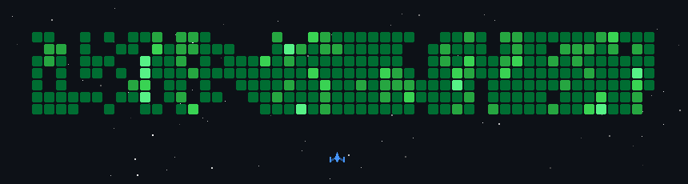

<h2>    Hi, I'm Albin! </h2>

### ✨ "Passionate AI Full Stack Developer turning ideas into reality" ✨

  
  
  
  

<!-- 

  
  
  
  

 -->

  
  

### 🌱 Intellectual Humility & Feeling Gratitude
> "***Everything we have learned, discovered, or innovated is built upon the life’s work of others. We are just identifying the patterns and building on top of what they already created. Therefore, whatever we achieve, much of the credit belongs to our ancestors, predecessors, and the people who work alongside us to make those achievements possible.***"  
>
> "We know very little about the things that we have already discovered and innovated. Every breakthrough, every question and every feedback reveals how much more there is to learn."
> "Be humble, thinking of others as better than yourselves. It helps us see new possibilities, recognize our own blind spots. There is always something to learn from everyone."

  
> Humility is recognizing that our achievements are the result of both our efforts and the contributions of the people around us.  
>  ***Mindset:** Understand & value strength. Eliminate weakness. View mistake as opportunity to grow. Accept there is always more to learn.*  
> ***CTA:** Ask questions. Seek feedback. Appreciate constructive criticism. Reflect & Learn from mistakes. Adjust & Improve --*  
> ***Habits**: Listen more than you speak. Observe more than you judge. Admit mistakes. Give credit where it's due.*
>
>  
> 
> Gratitude is the feeling of being deeply thankful for the kindness, help, or benefits we receive. Respect other people's efforts. 
> ***Mindset:** Value what we have and what we've been given. Value the effort and sacrifices made by others to achieve their success*  
> ***CTA:** Express sincere thanks. Give back when possible without expecting anything in return --* 
> ***Habits:** Acknowledge others' kindness. Reflect on daily blessings. Celebrate others' success.*

<!--
### 🚀 Quick Connect 📫 **How to reach me:** <a href="https://github.com/albindavidc#connect-me">Go Below</a>   
### 🚀 Quick Stats & Connect 
🔭 **I’m currently working on:** <a href="https://github.com/albindavidc/nirman-client.git">Nirman</a>    🌱 **I’m currently learning:** NestJS
-->

<!-- 

⚡
blue - 007ACC  005F73   08457E

orange - D2691E
  

 -->

  
  

<h1 align="center">🚀 Projects Completed 🌐</h1>

<!-- 
# Ongoing  💣 

 -->

 

  

    <table>
      <thead>
        <tr>
          <th>Project Name</th>
          <th>Project Description</th>
          <th>Live Link</th>
          <th>Repository</th>
        </tr>
      </thead>
      <tbody>
      <tr>
        <td>Nirman AI</td>
        <td>          
          <strong>Capstone Project:</strong> Enterprise-grade construction and procurement management platform built to streamline project execution, vendor operations, workforce management, and financial workflows. Implemented role-based dashboards, Gantt-based project scheduling, real-time communication, document management, AI-powered procurement assistance using RAG and vector search, and AI-driven cash-flow forecasting and recommendations. 
            
          <strong>Design: </strong> Figma, Prototyping, Wireframing, Mockups, User Persona Creation, Low & High Fidelity Prototypes
          <strong>Frontend:</strong> Angular, NgRx, Vercel, Feature-based Architecture, Angular Material, SCSS, ECharts, DHTMLX Gantt, FilePond, Google Maps, Stripe, Socket.io-client 
          <strong>Backend:</strong> Node.js, NestJS, Prisma, PostgreSQL, Redis, Socket.io, Clean Architecture, CQRS, PNPM, AWS S3, Docker, BullMQ, Passport/JWT, Stripe, PDFKit, ExcelJS, Winston, Nodemailer, Supabase, Winget, Doppler, Langchain, Google genai, Langgraph
        </td>
        <td align="center"><a href="https://nirman.albindavidc.com/">Live</a></td>
        <td align="center"><a href="https://github.com/albindavidc/nirman-client">Frontend</a> 
             
          <a href="https://github.com/albindavidc/nirman-server.git">Backend</a></td>
      </tr>
      <tr>
          <td>Vidya AI</td>
          <td>
            <strong>Portfolio Project:</strong> AI-enabled learning and knowledge platform designed around structured educational content, article creation, and role-based content management. Includes authenticated user workflows, OTP verification, article discovery, article authoring/editing, and article viewing.
              
            <strong>Frontend:</strong> Angular, SignalStore, Vercel, Tailwind CSS, PrimeNg, RxJS, NgRx, TS, Feature + Component-based Architecture, Es-lint, Prettier. 
            <strong>Backend:</strong> Node.js, Express, NestJS, MongoDB, Type ORM, Modular + Clean Architecture, Zod Validation, AWS, JWT, Passport, Argon, Brevo, TS, CQRS, Nginx, PM2, Git, DNS, SSL/TLS, PNPM, Es-lint, Prettier.
          </td>
          <td align="center"><a href="https://vidya.albindavidc.com/">Live</a></td>
          <td align="center"><a href="https://github.com/albindavidc/vidya-ai">Frontend</a> 
               
            <a href="https://github.com/albindavidc/vidya-server">Backend</a></td>
        </tr>
        <tr>
          <td>Icon Space</td>
          <td>
            <strong>Personal Project:</strong> Developer-focused SVG icon generation and embedding platform that lets users search, select, theme, resize, and arrange technology logos, then generate ready-to-use Markdown, HTML, or URL-based skill badges for GitHub profiles, READMEs, resumes, and portfolios. Includes an interactive builder and a lightweight Express API that dynamically composes SVG icons into optimized image responses.
              
            <strong>Frontend:</strong> HTML5, CSS3, JavaScript, Google AI Studio, Vercel, Simple Icons
             
            <strong>Backend:</strong> Node.js, Express.js
          </td>
          <td align="center"><a href="https://icon-space.vercel.app/">Live</a></td>
          <td align="center"><a href="https://github.com/albindavidc/icon-space">Repo</a></td>
        </tr>  
        <tr>
          <td>Pixel Mastery</td>
          <td>
            <strong>Personal Project:</strong> Interactive web-development learning platform focused on mastering HTML, JavaScript DOM/BOM APIs, CSS layouts, and Tailwind CSS through structured curricula, visual roadmaps, real-world challenges, and hands-on coding playgrounds. Features an embedded CodeMirror 6 editor with syntax highlighting, formatting, Emmet autocomplete, live code execution, and real-time previews, with progress tracking across learning modules.
              
            <strong>Frontend:</strong> AI Studio, React, Netlify
          </td>
          <td align="center"><a href="https://pixel-mastery.netlify.app/">Live</a></td>
          <td align="center"><a href="https://github.com/albindavidc/pixel-mastery">Repo</a></td>
        </tr>
        <tr>
          <td>Nexus AI</td>
          <td>
            <strong>Portfolio Project:</strong> Real-time AI fitness and calisthenics community platform that combines social interaction with personalized AI coaching. Users can communicate through real-time chat, participate in groups, receive notifications, and interact with an AI fitness coach for workout planning, exercise progressions, form guidance, and overcoming training plateaus.
              
            <strong>Frontend:</strong> Angular, Vercel, Feature-based Architecture 
            <strong>Backend:</strong> Node.js, Express.js, Mongoose, MongoDB, Socket.io, Modular Architecture, AWS, S3
          </td>
          <td align="center"><a href="https://nexus.albindavidc.com/">Live</a></td>
          <td align="center"><a href="https://github.com/albindavidc/nexus">Frontend</a> 
               
            <a href="https://github.com/albindavidc/nexus-server.git">Backend</a></td>
        </tr>
        <tr>
          <td>Monkeytype</td>
          <td>
            <strong>Open Source Contribution Project:</strong>
            Contributed production fixes and feature enhancements to Monkeytype, a highly customizable open-source typing platform. Implemented and shipped challenge-system improvements, including reliable challenge loading from URL parameters, improved asynchronous initialization and notification handling, and a new "Ten Words of Pain" Wingdings challenge with custom-font configuration, Master-mode constraints, and validation requirements.
              
            <strong>Contributions:</strong>
            <ul>
              <li>
                <strong>Challenge URL Loading:</strong>
                Fixed challenge initialization through URL parameters by coordinating asynchronous authentication/loading state, preventing race conditions, and improving success/error notification behavior.
              </li>
              <li>
                <strong>Wingdings Challenge:</strong>
                Added the "Ten Words of Pain" challenge with a 10-word Master-mode test, Wingdings font configuration, disabled keymap, 60+ WPM requirement, and 100% accuracy requirement.
              </li>
              <li>
                <strong>Challenge System:</strong>
                Extended challenge schema and controller logic to support the new challenge type and integrated configuration changes into the existing challenge lifecycle.
              </li>
            </ul>
             
            <strong>Additional Contributions:</strong>
            Proposed quote-tagging and content-categorization improvements for English, Malayalam, Tamil, and Kannada quote datasets, including UI filtering, metadata schemas, and localized tag structures.
          </td>
          <td align="center">
            <a href="YOUR_EXISTING_PR_SEARCH_LINK">Pull Requests</a>
              
            <a href="YOUR_EXISTING_DISCUSSIONS_LINK">Discussions</a>
          </td>
          <td align="center">
            <a href="YOUR_EXISTING_FORK_LINK">Code</a>
          </td>
        </tr>
        <tr>
          <td>Udyama</td>
          <td>
            <strong>Personal Project:</strong> Structured calisthenics and bodyweight training platform designed to guide users through progressive strength development and long-term mastery. Features a 7-day “Apex Engine” training program with structured protocols, a visual movement library, a seven-layer mastery progression system, achievement tracking, a physical-development pillar matrix, and a progress-focused dashboard.
              
            <strong>Frontend:</strong> AI Studio - React, Vercel
          </td>
          <td align="center"><a href="https://udyama.vercel.app/">Live</a></td>
          <td align="center"><a href="https://github.com/albindavidc/udyama">Repo</a></td>
        </tr>
        <tr>
          <td>Arogya</td>
          <td>
            <strong>Personal Project:</strong> Modern yoga and wellness platform providing a structured library of asanas and pranayama practices. Organizes poses into progressive practice phases and provides interactive pose guides with Sanskrit names, step-by-step instructions, recommended pranayama and mudra pairings, and difficulty-based frequency and duration guidance. Includes gender-specific visual demonstrations, a curated “Top 5” routine, and a responsive mobile-first interface. (Still in progress)
              
            <strong>Frontend:</strong> AI Studio - Angular, Gemini - Nano banana, Vercel  
          </td>
          <td align="center"><a href="https://arogya.vercel.app/">Live</a></td>
          <td align="center"><a href="https://github.com/albindavidc/arogya">Repo</a></td>
        </tr>
        <tr>
          <td>Keep Archive</td>
          <td>
            <strong>Personal Project:</strong> Privacy-first local media archiving application designed to preserve WhatsApp statuses and stories directly on the user's device without uploading media to external servers. Provides automatic status-directory detection, local media processing, searchable archive management, image/video viewing, native sharing, custom storage locations including SD cards, and web-to-native mobile support through Capacitor.
              
            <strong>Frontend:</strong> AI Studio - Angular, Vercel  
          </td>
          <td align="center"><a href="https://keep-archive.vercel.app/">Live</a></td>
          <td align="center"><a href="https://github.com/albindavidc/keep-archive">Repo</a></td>
        </tr>
        <tr>
          <td>Memora</td>
          <td>
            <strong>Personal Project:</strong> Lightweight floating desktop note-taking application focused on fast, distraction-free knowledge capture and keyboard-driven productivity. Provides smart text formatting, keyboard shortcuts, ordered lists, real-time spell checking with learned corrections, bulk note management, and an optimized floating interface designed for rapid note creation and editing.
              
            <strong>Frontend:</strong> Antigravity - Electron, React 
          </td>
          <td align="center"><a href="https://github.com/albindavidc/memora/releases/tag/v2.0.0">Live</a></td>
          <td align="center"><a href="https://github.com/albindavidc/memora">Repo</a></td>
        </tr>
        <tr>
          <td>Chrono Mind</td>
          <td>
            <strong>Personal Project:</strong> Multi-purpose time-management application combining countdown timers, customizable multi-step sequence timers, stopwatch functionality, lap tracking, and configurable audio notifications. Supports reusable workout and productivity sequences, local persistence of custom routines, swipe-based navigation, screen wake lock, and PWA installation for a native-like mobile experience.
              
            <strong>Frontend:</strong> AI Studio - React, Netlify  
          </td>
          <td align="center"><a href="https://chrono-mind.netlify.app/">Live</a></td>
          <td align="center"><a href="https://github.com/albindavidc/chrono-mind">Repo</a></td>
        </tr>
        <tr>
          <td>Math Logic</td>
          <td>
            <strong>Personal Project:</strong>Modern, responsive mathematical calculator built for fast everyday calculations with a polished glassmorphism interface. Supports chained arithmetic operations, parentheses, input validation and sanitization, precision-aware result formatting, timestamped calculation history, and a responsive PWA-ready interface with animated interactions.
              
            <strong>Frontend:</strong> AI Studio - React, Netlify 
          </td>
          <td align="center"><a href="https://math-logic.netlify.app/">Live</a></td>
          <td align="center"><a href="https://github.com/albindavidc/math-logic">Repo</a></td>
        </tr>
        <tr>
          <td>Unbound</td>
          <td>
            <strong>Capstone Project:</strong> Full-stack e-commerce platform providing a complete customer shopping experience and administrative management system. Supports local and Google OAuth authentication, product discovery and filtering, customizable product design through an interactive canvas editor, cart and wishlist management, Razorpay payments, virtual wallet and refund workflows, coupons and referral programs, order tracking, address management, and profile customization. The admin platform provides product/category management, order and payment tracking, promotional tools, sales analytics, and automated PDF/Excel report generation.
              
            <strong>Design: </strong> Figma, Prototyping, Wireframing, Mockups, User Persona Creation, Low & High Fidelity Prototypes
            <strong>Frontend:</strong> EJS, Tailwind CSS, SweetAlert2, Cropper.js, JS-Image-Zoom, Fabric.js, jsPDF, jbValidator, Iconify, PostCSS, Autoprefixer 
            <strong>Backend:</strong>  Node.js, Express.js, MongoDB, Mongoose, MVC Architecture, Passport.js, OAuth, Bcrypt.js, Express-Session, Multer, Sharp, Jimp, ExcelJS, PDFKit, Puppeteer, Razorpay, Nodemailer, Dotenv, Morgan, Compression 
            <strong>Deployment:</strong> Google Cloud Platform (GCP), Nginx, PM2, Git, DNS, SSL/TLS
          </td>
          <td align="center"><a href="https://unbound.albindavidc.com/">Live</a></td>
          <td align="center"><a href="https://github.com/albindavidc/unbound">Monorepo</a></td>
        </tr>
        <tr>
          <td>Immersify</td>
          <td>
            <strong>Collaborative Project:</strong> Hackathon project delivering immersive background music experiences while reading books for children.
              
          </td>
          <td align="center">—</td>
          <td align="center"><a href="https://github.com/albindavidc/Tek-A-Thon.git">Repo</a></td>
        </tr>
      </tbody>
    </table>

    

  
<strong>Read More</strong>

   

  <table>
    <thead>
      <tr>
        <th>Project Name</th>
        <th>Project Description</th>
        <th>Live Link</th>
        <th>Repository</th>
      </tr>
    </thead>
    <tbody>
      <tr>
        <td>BarkX</td>
        <td>Pet store platform designed for discovering and managing pet-related products and services.</td>
        <td align="center">—</td>
        <td align="center"><a href="https://github.com/albindavidc/BarkX.git">Repo</a></td>
      </tr>
      <tr>
        <td>A.S.P.W.C.R</td>
        <td>Automatic suction-powered wall climbing robot project focused on robotics and mechanical innovation.</td>
        <td align="center">—</td>
        <td align="center"><a href="https://github.com/albindavidc/Automatic-Suction-Powered-Wall-Climbing-Robot.git">Repo</a></td>
      </tr>
      <tr>
        <td>Under Water Drone Project</td>
        <td>Exploratory underwater drone project focused on aquatic navigation and robotics systems.</td>
        <td align="center">—</td>
        <td align="center"><a href="https://github.com/albindavidc/Under-Water-Drone-Project.git">Repo</a></td>
      </tr>
      <tr>
        <td>C.A.S.C</td>
        <td>Customer Assistance Smart Cart designed to enhance retail shopping experiences through smart automation.</td>
        <td align="center">—</td>
        <td align="center"><a href="https://github.com/albindavidc/CASC.git">Repo</a></td>
      </tr>
    </tbody>
  </table>

  

   

<!--
<tr>
  <td>Arche</td>
  <td>Private digital platform focused on intelligent workflows, organization, and modern user experiences.</td>
  <td align="center"><a href="#">Live</a></td>
  <td align="center">Private</td>
</tr>

<tr>
  <td>Next Offer</td>
  <td>Private platform designed for managing offers, deals, and business-oriented workflows.</td>
  <td align="center"><a href="#">Live</a></td>
  <td align="center">Private</td>
</tr>
-->

<!-- 

  
  

  
   
  
  
<h1 align="center">My Favorites</h1> 
  -->

   

---

# 💻 Tech Stack: 

                                         
                  

 

---

## 🔥 LeetCode Journey

<!--  -->

   

---
###

 
<h1 align="center">💬 Let’s Chat</h1>

###

 

   

   

   

---

   

# 🛠️ Professional Toolkit

## 💻 Languages

| 🌐 Web Languages | 💻 Programming Languages | 🗄️ Database |
| --- | --- | --- |
| HTML5 *(Markup Language)* | JavaScript | MongoDB Query Language (MQL) |
| CSS3 *(Style Sheet Language)* | TypeScript | PostgreSQL |
| SASS *(Style Sheet Preprocessor)* |  |  |
| EJS *(Template Language)* |  |  |

---

## 🧩 Frameworks & Libraries

| 🎨 Frontend | ⚙️ Backend | 🗄️ Database | 📊 Utilities |
| --- | --- | --- | --- |
| Angular | Node.js  | Mongoose | RxJS |
| NgRx | Express.js  | Prisma  | Chart.js |
| Tailwind CSS | NestJS  | TypeORM | ESLint |
| Bootstrap | Socket.IO |  | Prettier |

---

## 🛠️ Tools, Platforms & Services

| ☁️ Cloud & DevOps | 🎨 Design | 🤖 AI | 🚀 Development |
| --- | --- | --- | --- |
| Git | Figma | Google AI Studio | VS Code |
| GitHub | Framer | Gemini (GenAI) | Cursor |
| Docker | Canva | Claude | Copilot |
| AWS | Photoshop | Claude Code | Postman |
| GCP | Blender | Claude Design | NPM/PNPM |
| Vercel | Adobe XD | Nano Banana | Antigravity |
| Netlify | Notion | Stitch |  |
| NGINX |  | Figma Make |  |

   

---

###

 

  
# 📊 GitHub Stats:

<!-- 

-->

 

 

---

###

 

<!--  -->

###
